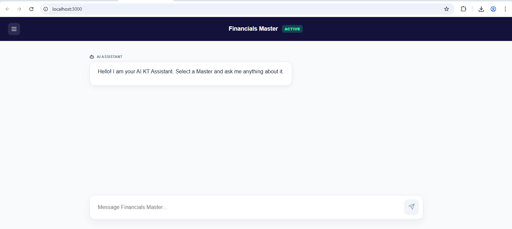
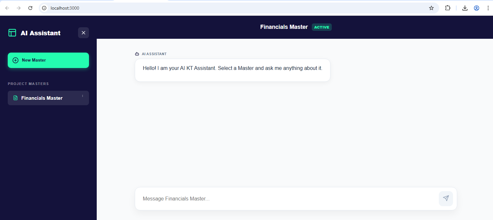
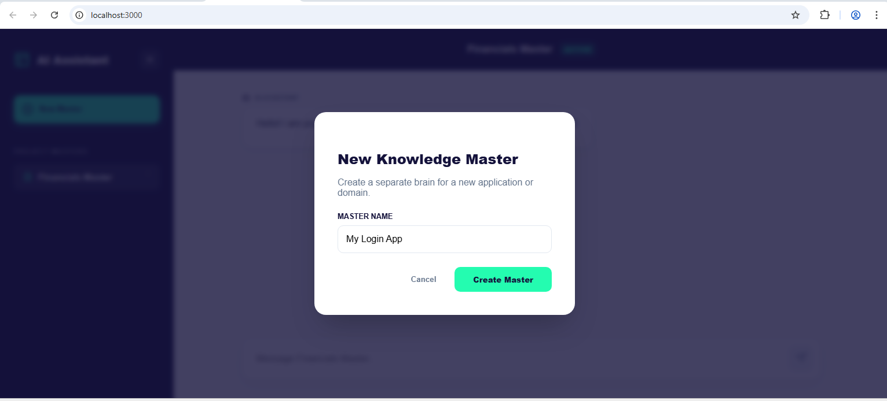
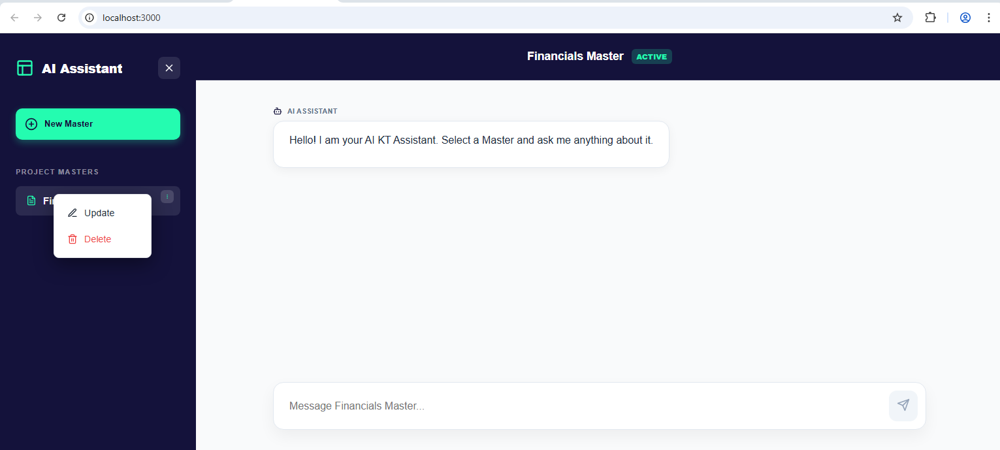

# 🤖 AI KT Assistant

An advanced AI-powered **Knowledge Transfer (KT) Assistant** designed to bridge the gap between complex project documentation and developer understanding. Leveraging **Retrieval-Augmented Generation (RAG)**, this tool provides instant, context-aware answers to help engineers onboard and master project domains faster.

---

## 📸 Application Preview

Below are screenshots demonstrating the core features and user interface of the AI KT Assistant:

### 1. Smart Chat Interface
Experience real-time, context-aware conversations powered by your project's specific knowledge base.


### 2. Multi-Master Management
Organize documentation into different "Masters" for multiple projects or functional domains.


### 3. Knowledge Training Ground
Easily ingest new documentation via text pasting or file uploads (PDF, Word, Text).


### 4. Interactive Sidebar
Seamlessly switch between different knowledge bases and manage your project masters.


### 5. Advanced Search & Retrieval
The system uses vector embeddings to retrieve the most relevant snippets for every query.


---

## 🚀 Key Features

- **Multi-Master Support**: Create isolated knowledge silos for different repositories or project modules.
- **Advanced RAG Engine**: Utilizes LangChain4j and high-performance vector embeddings for precise context retrieval.
- **Persistent Knowledge**: Automatically serializes indexed data to `embeddings.json` and `masters.txt`, ensuring no loss of trained data.
- **Local-First AI (Ollama)**: Integrated with **Ollama** for data privacy and zero API costs. Default models: `phi3` (LLM) and `nomic-embed-text` (Embeddings).
- **Format Agnostic**: Support for `.pdf`, `.docx`, `.doc`, `.txt`, and `.md` files.
- **Modern Streaming UI**: Built with React, featuring token streaming and Markdown rendering for a professional chat experience.

---

## 🛠️ Tech Stack

| Layer | Technologies |
| :--- | :--- |
| **Frontend** | React, Lucide-Icons, React-Markdown, Axios |
| **Backend** | Java 17+, Spring Boot 3.x, LangChain4j |
| **Intelligence** | Ollama (Local LLM Execution) |
| **Storage** | File-based Persistent Vector Store |

---

## 🏁 Getting Started

### Prerequisites
- **Java 17+** & **Maven**
- **Node.js 18+** & **npm**
- **Ollama**: [Download here](https://ollama.com/)
  ```bash
  ollama pull phi3
  ollama pull nomic-embed-text
  ```

### Backend Setup
1. Navigate to `ai-chatbot-service`.
2. (Optional) Tune RAG settings in `src/main/resources/application.properties`.
3. Run the service:
   ```bash
   mvn clean spring-boot:run
   ```

### Frontend Setup
1. Navigate to `ai-chatbot-ui`.
2. Install dependencies:
   ```bash
   npm install
   ```
3. Start the application:
   ```bash
   npm start
   ```

---

## 📖 Usage Guide
1. **Define a Master**: Click **"New Master"** in the sidebar to create a new knowledge context.
2. **Sync Knowledge**: Go to the **"Training Ground"** and upload your project docs or paste architecture notes.
3. **Ask & Learn**: Select your Master in the sidebar and start asking questions like:
   - *"How is the authentication flow implemented?"*
   - *"What are the key database entities for the billing module?"*

---

## 👨‍💻 Author
**Muhammad Waqar**

---
*Created with ❤️ to empower developers through AI.*
